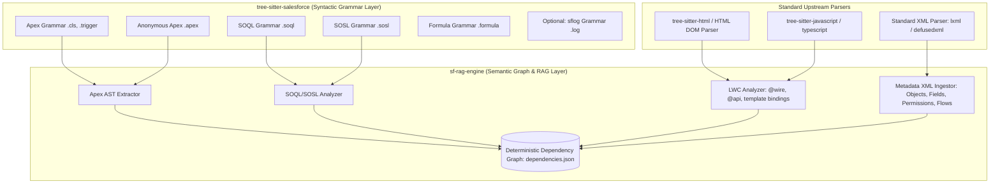

# Comprehensive Salesforce Ecosystem Gap Analysis & Architectural Roadmap

This document provides an exhaustive comparative audit of **`tree-sitter-salesforce`** against reference parsers and code intelligence engines in the Salesforce ecosystem:
1. **`tree-sitter-sfapex`** (Tree-sitter parser by Anthony Heber, v3.0.0)
2. **`apex-parser`** (Industry-standard ANTLR4 reference parser by FinancialForce / ApexDevTools, v5.1.0 Summer '26 baseline)
3. **`codebase-memory-mcp`** (Enterprise C-based AST semantic graph & symbol indexing engine)
4. **`sf-rag-engine`** (Downstream Salesforce static dependency graph & RAG pipeline)

---

## 1. Architectural Boundary & Separation of Concerns

To keep `tree-sitter-salesforce` high-performance, maintainable, and aligned with standard compiler architecture, responsibilities are partitioned between **Syntactic Parser Layer (`tree-sitter-salesforce`)** and **Semantic Graph Layer (`sf-rag-engine`)**:



### Architectural Decision
1. **`tree-sitter-salesforce`**: Implements grammars **only** for languages with proprietary Salesforce syntax that standard off-the-shelf parsers cannot parse:
   - **Apex** (`.cls`, `.trigger`)
   - **Anonymous Apex** (`.apex`)
   - **SOQL** (`.soql`)
   - **SOSL** (`.sosl`)
   - **Salesforce Formula Language** (`.formula`)
   - **Salesforce Debug Logs** (`.log` / `sflog`)
2. **`sf-rag-engine`**: Ingests **Metadata XML** and **LWC components** using standard upstream parsers:
   - **Metadata XML (`*-meta.xml`)**: Ingested via fast standard XML libraries (`defusedxml` / `lxml`) to extract Object, Field, PermissionSet, Profile, and Flow entities.
   - **LWC JS/TS (`.js`, `.ts`)**: Parsed via standard `tree-sitter-javascript` / `tree-sitter-typescript` to extract `@wire`, `@api`, `@track`, and `@salesforce/*` scoped imports.
   - **LWC HTML (`.html`)**: Parsed via standard `tree-sitter-html` / DOM parser to extract `{prop}` bindings and `lwc:*` directives.

---

## 2. Master Parity & Improvement Matrix

> **Status legend**: ✅ Implemented | ⚠️ Partial | ❌ Missing

| Layer / Area | Construct / Feature | `tree-sitter-sfapex` | `apex-parser` (v5.1.0) | `tree-sitter-salesforce` | Target Location | Priority | Status / Impact |
| :--- | :--- | :--- | :--- | :--- | :--- | :--- | :--- |
| **Apex** | **Methods in Interfaces** | Supported | Supported | ❌ `interface_body` has only `field_declaration` | `tree-sitter-salesforce` | **P0** | Critical Syntax Bug |
| **Apex** | **Generic `implements`/`extends`** | Supported | Supported | ❌ Uses `type_identifier` instead of `_type` | `tree-sitter-salesforce` | **P0** | Critical Syntax Bug |
| **Apex** | **Map Literals (`key => val`)** | Supported | Supported | ❌ `=>` token missing | `tree-sitter-salesforce` | **P0** | Critical Syntax Gap |
| **Apex** | **Static & Instance Initializers** | Supported | Supported | ❌ Missing from `_class_body_declaration` | `tree-sitter-salesforce` | **P1** | Common Apex Pattern |
| **Apex** | **`System.runAs(...) { ... }`** | Supported | Supported | ❌ None (causes parse error) | `tree-sitter-salesforce` | **P1** | Standard Test Syntax |
| **Apex** | **Modern DML Security Modes** | Supported | Supported | ❌ Only basic `insert acc;` | `tree-sitter-salesforce` | **P1** | API v54+ Security Standard |
| **Apex** | **Trigger Helper Declarations** | Supported | Supported | ❌ `trigger_body` only has `statement` | `tree-sitter-salesforce` | **P1** | Trigger Helper Syntax |
| **Apex** | **Constructor Calls (`this/super`)** | Supported | Supported | ❌ Keywords shadow `method_invocation` | `tree-sitter-salesforce` | **P1** | Constructor Chaining |
| **Apex** | **Switch `when` Patterns** | Expressions | Signed numbers, qualified enums, parens | ❌ Lacks signed/qualified enums | `tree-sitter-salesforce` | **P1** | Switch Pattern Parity |
| **Apex** | **Multi-line Strings (`'''...'''`)** | Supported | Supported (Summer '26) | ❌ Only single-line `'...'` | `tree-sitter-salesforce` | **P1** | Summer '26 Platform Feature |
| **Apex** | **Array Dimension Sizing** | Supported | Supported | ❌ Only `new String[]` without size | `tree-sitter-salesforce` | **P1** | Array Instantiation |
| **Apex** | **`switch on` / `when else` Case-Insensitivity** | Supported | Supported | ❌ Hard-coded string literals, not `ci()` | `tree-sitter-salesforce` | **P1** | Grammar Correctness |
| **Apex** | **Extended Literals & Reflections** | `100L`, `1.2e-5` | `LongLiteral`, `void.class` | ❌ Basic integers/decimals only | `tree-sitter-salesforce` | **P2** | Literal Edge Cases |
| **Apex** | **`class_literal` (`Type.class`)** | Supported | Supported | ❌ Missing | `tree-sitter-salesforce` | **P2** | Reflection Pattern |
| **SOQL** | **`FORMULA(...)` in `WHERE`** | ❌ None | Supported (Summer '26) | ❌ None | `tree-sitter-salesforce` | **P1** | Summer '26 SOQL Feature |
| **SOQL** | **`ALL ROWS` Clause** | Supported | Supported | ❌ Missing in `soql/grammar.js` | `tree-sitter-salesforce` | **P1** | Soft-delete / Archive Query |
| **SOQL** | **`USING` Clause** | Supported | Supported | ⚠️ `USING SCOPE` implemented; `LOOKUP … BIND` missing | `tree-sitter-salesforce` | **P2** | Scope & Filter Parity |
| **SOQL** | **`WITH` Security Clause** | Supported | Supported | ⚠️ `USER_MODE`/`SYSTEM_MODE`/`SECURITY_ENFORCED`/`DATA CATEGORY` done; `RecordVisibilityContext` missing | `tree-sitter-salesforce` | **P2** | Modern SOQL Feature |
| **SOQL** | **`TimeLiteral` & `CONVERT_TIMEZONE`**| ❌ None | Supported | ❌ Missing | `tree-sitter-salesforce` | **P2** | Time Field & Timezone Support |
| **SOSL** | **Standalone Syntax (`{term}`)** | Supported | Supported | ❌ Only single quotes `'term'` | `tree-sitter-salesforce` | **P1** | Standalone SOSL Parity |
| **SOSL** | **Modern `WITH` Clauses** | Supported | Supported | ⚠️ Has `highlight`, `snippet`, `division`, `network` (string form), `pricebook_id`; missing `USER_MODE`, `SYSTEM_MODE`, `METADATA`, `NETWORK IN (list)`, `SNIPPET (TARGET_LENGTH=n)`, `:bindVariable` on `DIVISION` | `tree-sitter-salesforce` | **P1** | Modern SOSL Security & Params |
| **SOSL** | **Projections in `RETURNING`** | Supported | Supported | ❌ Plain field paths only | `tree-sitter-salesforce` | **P2** | SOSL Reporting Projections |
| **Formula** | **`GEOLOCATION()` / `DISTANCE()` Functions** | ❌ None | N/A | ❌ Not in `function_name` whitelist | `tree-sitter-salesforce` | **P1** | Geo-formula Fields |
| **Formula** | **Missing Date/Time Functions** | ❌ None | N/A | ❌ `TIMENOW`, `ISOWEEK`, `ISOYEAR`, `UNIXTIMESTAMP` absent | `tree-sitter-salesforce` | **P1** | Formula Date Completeness |
| **Formula** | **`$RecordType` / `$Setup` Global Variables** | ❌ None | N/A | ⚠️ Syntactically parses via `$` + identifier chain; no enumerated validation | `tree-sitter-salesforce` | **P2** | Global Variable Coverage |
| **Formula** | **`IMAGE()` Named-Field Node** | ❌ None | N/A | ⚠️ `IMAGE` in whitelist; treated as generic function call | `tree-sitter-salesforce` | **P2** | Formula Field Rich Content |
| **Formula** | **Scientific Notation Numbers** | ❌ None | N/A | ❌ `1.2e-5` not matched by `number` regex | `tree-sitter-salesforce` | **P2** | Numeric Literal Edge Case |
| **Debug Logs**| **Salesforce Debug Logs (`sflog`)** | Supported | ❌ None | ❌ None | `tree-sitter-salesforce` | **P2** | Tooling & Log Analysis |

---

## 3. Detailed Apex Grammar Fixes (`tree-sitter-salesforce`)

### 3.1 [P0] Method & Constant Declarations in Interface Bodies
* **Current Bug** ([apex/grammar.js#L299](file:///d:/Git/tree-sitter-salesforce/apex/grammar.js#L299)):
  `interface_body` only contains `repeat(choice($.field_declaration, ";"))`.
* **Fix**:
  ```javascript
  interface_body: ($) => seq(
    "{",
    repeat(choice(
      $.field_declaration,
      $.method_declaration,
      $.class_declaration,
      $.interface_declaration,
      $.enum_declaration,
      ";"
    )),
    "}"
  ),
  ```

### 3.2 [P0] Generic Type Arguments in `implements` and `extends`
* **Current Bug** ([apex/grammar.js#L214-L220](file:///d:/Git/tree-sitter-salesforce/apex/grammar.js#L214-L220)):
  `superclass` and `interfaces` use `$.type_identifier` instead of `$._type`.
  This means `implements Comparable<Account>` or `extends MyGeneric<String>` will fail to parse.
* **Fix**:
  ```javascript
  superclass: ($) => seq(ci("extends"), $._type),
  interfaces: ($) => seq(ci("implements"), commaJoined1($._type)),
  ```
  Also apply to `interface_declaration`'s `extends` clause ([apex/grammar.js#L295](file:///d:/Git/tree-sitter-salesforce/apex/grammar.js#L295)):
  ```javascript
  optional(seq(ci("extends"), commaJoined1($._type))),
  ```

### 3.3 [P0] Map Literal Initializers (`=>`)
* **Current Bug**: `=>` is not a defined token. `new Map<String,String>{'key' => 'val'}` causes a parse error.
* **Fix**:
  ```javascript
  map_key_initializer: ($) => seq($.expression, "=>", $.expression),
  map_initializer: ($) => seq("{", commaJoined($.map_key_initializer), "}"),
  ```
  Update `new_expression` to choose between `$.argument_list`, `$.array_initializer`, and `$.map_initializer`.

### 3.4 [P1] Static & Instance Initializers
* **Fix**: Add `static_initializer` and bare `block` (instance initializer) to `_class_body_declaration`:
  ```javascript
  static_initializer: ($) => seq(ci("static"), $.block),
  ```
  Update `_class_body_declaration`:
  ```javascript
  _class_body_declaration: ($) => choice(
    $.field_declaration,
    $.method_declaration,
    $.constructor_declaration,
    $.property_declaration,
    $.static_initializer,  // NEW
    $.block,               // NEW — instance initializer
    $.class_declaration,
    $.interface_declaration,
    $.enum_declaration,
    ";",
  ),
  ```

### 3.5 [P1] Helper Member Declarations Inside Triggers
* **Current Bug** ([apex/grammar.js#L366](file:///d:/Git/tree-sitter-salesforce/apex/grammar.js#L366)):
  `trigger_body` only accepts `repeat($.statement)`. Triggers can declare helper variables and inner classes at the top level.
* **Fix**:
  ```javascript
  trigger_body: ($) => seq("{", repeat(choice($.statement, $._class_body_declaration)), "}"),
  ```

### 3.6 [P1] Explicit Constructor Invocations (`this(...)` & `super(...)`)
* **Current Bug**: `this(...)` and `super(...)` inside constructors are not separately modelled and shadow `method_invocation`.
* **Fix**: Add `explicit_constructor_invocation`:
  ```javascript
  explicit_constructor_invocation: ($) => seq(
    choice(
      seq(optional(field("type_arguments", $.type_arguments)), choice($.this, $.super)),
      seq(field("object", $.primary_expression), ".", optional(field("type_arguments", $.type_arguments)), $.super)
    ),
    field("arguments", $.argument_list),
    ";"
  ),
  ```

### 3.7 [P1] `System.runAs(...) { ... }` Testing Statement
* **Current Bug**: `System.runAs(user) { ... }` has no dedicated rule and causes a parse error.
* **Fix**:
  ```javascript
  run_as_statement: ($) => seq(
    ci("System.runAs"),
    field("user", $.parenthesized_expression),
    $.block
  ),
  ```

### 3.8 [P1] Modern DML Security Modes (`as user` / `as system`) & Extended DML
* **Current Bug** ([apex/grammar.js#L911](file:///d:/Git/tree-sitter-salesforce/apex/grammar.js#L911)):
  `dml_statement` has no `as user`/`as system` security mode support.
* **Fix**:
  ```javascript
  dml_security_mode: ($) => choice(ci("user"), ci("system")),
  dml_statement: ($) => seq(
    $.dml_type,
    optional(seq(ci("as"), $.dml_security_mode)),
    $.expression,
    optional($.expression),
    ";"
  ),
  ```

### 3.9 [P1] `switch on` and `when else` Must Use Case-Insensitive Matching
* **Current Bug** ([apex/grammar.js#L833](file:///d:/Git/tree-sitter-salesforce/apex/grammar.js#L833)):
  `switch_statement` uses the bare string `"switch on"` and `when_else_clause` uses `"when else"`. Apex keywords are case-insensitive — `Switch On` and `SWITCH ON` are valid but will fail to parse.
* **Fix**:
  ```javascript
  switch_statement: ($) => seq(
    ci("switch"), ci("on"), field("condition", $.expression), "{",
    repeat($.when_clause),
    optional($.when_else_clause),
    "}"
  ),
  when_else_clause: ($) => seq(ci("when"), ci("else"), field("body", $.block)),
  ```

### 3.10 [P1] Summer '26 Multi-Line String Literals (`'''...'''`)
* **Fix**:
  ```javascript
  multi_line_string_literal: ($) => seq("'''", /[\r\n]/, repeat(/[^']|'[^']|''[^']|\\'/),"'''"),
  ```

### 3.11 [P1] Array Creation with Explicit Sizing
* **Fix**: Support dimension expressions `new String[10]` in `new_expression`:
  ```javascript
  array_creation_expression: ($) => seq(
    ci("new"),
    field("type", $._type),
    "[",
    field("size", $.expression),
    "]"
  ),
  ```

### 3.12 [P2] Extended Literals (`100L`, `1.2e-5`) & Class Literals (`void.class`)
* **Fix**: Add `long_literal`, `scientific_decimal`, and `class_literal`:
  ```javascript
  long_literal:       ($) => token(seq(/[0-9]+(_[0-9]+)*/, choice("L", "l"))),
  scientific_decimal: ($) => /\d+\.\d+[eE][+-]?\d+/,
  class_literal:      ($) => seq($._type, ".", ci("class")),
  ```

---

## 4. SOQL & SOSL Grammar Enhancements (`tree-sitter-salesforce`)

### 4.1 SOQL Enhancements (`soql/grammar.js`)

> **Already Implemented**: `USING SCOPE` ([soql/grammar.js#L285](file:///d:/Git/tree-sitter-salesforce/soql/grammar.js#L285)) and `WITH USER_MODE`/`SYSTEM_MODE`/`SECURITY_ENFORCED`/`DATA CATEGORY` ([soql/grammar.js#L417](file:///d:/Git/tree-sitter-salesforce/soql/grammar.js#L417)) are fully implemented. Only the gaps below remain.

* **[P1] SOQL `FORMULA(...)` in `WHERE` Clauses (Summer '26 / v5.1.0)**:
  `WHERE FORMULA('Birthdate + 365') > TODAY`.
  Add a `formula_expression` node to `_value_expression` and `_condition_expression`.

* **[P1] SOQL `ALL ROWS` Clause**:
  Support `ALL ROWS` at end of queries (queries recycle bin and archived records).
  Add `all_rows_clause` as an optional terminal in `soql_query_body`.

* **[P2] `USING LOOKUP … BIND` Variant**:
  The `using_clause` currently only handles `USING SCOPE`. Add the search filter lookup variant:
  `USING LOOKUP fieldName IN ('val1','val2') BIND fieldName = :expr`

* **[P2] `WITH RecordVisibilityContext(...)`**:
  Multi-parameter record visibility configuration — add to `soql_with_clause`:
  `WITH RecordVisibilityContext(maxDescribeValueLength=3)`

* **[P2] SOQL `TimeLiteral` & `CONVERT_TIMEZONE`**:
  Time field literals `01:00:00.000Z` and the `convertTimezone(...)` date function.

### 4.2 SOSL Enhancements (`sosl/grammar.js`)

* **[P1] Standalone Delimiters (`{search_term}`)**:
  Support curly brace queries `FIND {Acme*}`. Currently only `'...'` single-quoted strings are accepted as `_search_term`.

* **[P1] Modern SOSL `WITH` Clauses**:
  The current `with_clause` ([sosl/grammar.js#L179](file:///d:/Git/tree-sitter-salesforce/sosl/grammar.js#L179)) has `highlight`, `snippet`, `spell_correction`, `division = 'str'`, `network = 'str'`, `pricebook_id = 'str'`.
  **Missing variants**:
  - `WITH USER_MODE` / `WITH SYSTEM_MODE`
  - `WITH METADATA = '...'`
  - `WITH NETWORK IN ('net1', 'net2')` (list form; currently only `= 'str'`)
  - `WITH SNIPPET (TARGET_LENGTH = n)` (parameterized)
  - `WITH DIVISION = :bindVariable` (bind variable; currently only string literals)

* **[P2] Projections in `RETURNING`**:
  Support `toLabel()`, `convertCurrency()`, and `FORMAT()` in `RETURNING` field lists (currently only plain `field_path`).

---

## 5. Formula Grammar Gaps (`tree-sitter-salesforce`)

The Formula grammar ([formula/grammar.js](file:///d:/Git/tree-sitter-salesforce/formula/grammar.js)) is implemented but has no coverage in the parity table or a dedicated action plan section.

### 5.1 [P1] Missing Geo-Formula Functions
* **Current Gap**: `GEOLOCATION(lat, lon)` and `DISTANCE(field, GEOLOCATION(...), 'km')` are not in the `function_name` whitelist ([formula/grammar.js#L90](file:///d:/Git/tree-sitter-salesforce/formula/grammar.js#L90)).
* **Fix**: Add to `function_name`:
  ```javascript
  ci("GEOLOCATION"), ci("DISTANCE"),
  ```

### 5.2 [P1] Missing Date/Time Functions
* **Current Gap**: `TIMENOW()`, `ISOWEEK()`, `ISOYEAR()`, `UNIXTIMESTAMP()` are absent from the `function_name` list.
* **Fix**: Extend `function_name` with the missing date-time functions.

### 5.3 [P2] Global Variable Enumeration (`$RecordType`, `$Setup`, `$Permission`)
* **Current State**: `global_variable` ([formula/grammar.js#L177](file:///d:/Git/tree-sitter-salesforce/formula/grammar.js#L177)) parses `$` + identifier chain correctly but provides no enumerated validation of known `$` namespaces.
* **Gap**: No `global_context` rule with a curated list of known prefixes — limits accurate syntax highlighting and tooling.

### 5.4 [P2] `IMAGE()` Named-Field Node
* **Current State**: `IMAGE` is in `function_name` and treated as a generic `function_call`. Actual signature: `IMAGE(img_url, alt_text [, height, width])`.
* **Gap**: No dedicated `image_expression` node with named fields — makes the node opaque to downstream tooling.

### 5.5 [P2] Numeric Literal Gaps
* **Current Bug** ([formula/grammar.js#L190](file:///d:/Git/tree-sitter-salesforce/formula/grammar.js#L190)):
  `number: ($) => /[0-9]+(\.[0-9]+)?/` does not support scientific notation (`1.2e-5`).
* **Fix**:
  ```javascript
  number: ($) => /[0-9]+(\.[0-9]+)?([eE][+-]?[0-9]+)?/,
  ```

---

## 6. Implementation Action Plan

### Phase 1: High Priority Apex Fixes in `tree-sitter-salesforce` (P0 & P1)
- [ ] Fix `interface_body` in `apex/grammar.js` (add method, inner class, enum declarations).
- [ ] Fix `superclass`, `interfaces`, and interface `extends` in `apex/grammar.js` (use `$._type` for generic arguments).
- [ ] Add `map_initializer` (`key => value`) and update `new_expression`.
- [ ] Add `static_initializer` (`static { ... }`) and bare `block` (instance initializer) to `_class_body_declaration`.
- [ ] Allow member declarations in `trigger_body`.
- [ ] Add `explicit_constructor_invocation` (`this(...)`, `super(...)`).
- [ ] Add `run_as_statement` (`System.runAs(...) { ... }`).
- [ ] Add `as user` / `as system` security modes to `dml_statement`.
- [ ] Fix `switch_statement` and `when_else_clause` to use `ci()` helpers, not bare string literals.
- [ ] Add Summer '26 `multi_line_string_literal` (`'''...'''`).
- [ ] Support signed numbers, qualified enums, and parentheses in switch `when` patterns.
- [ ] Add explicit dimension array allocations (`new String[10]`).
- [ ] Add `long_literal`, `scientific_decimal`, and `class_literal`.

### Phase 2: SOQL & SOSL Enhancements in `tree-sitter-salesforce` (P1 & P2)
- [ ] Add SOQL Summer '26 `FORMULA('...') = true` to `where_clause` / `_value_expression`.
- [ ] Add `ALL ROWS` clause to `soql/grammar.js`.
- [ ] ~~Implement `using_clause` in `soql/grammar.js`~~ ✅ Already implemented (`USING SCOPE` variants done).
- [ ] Add `USING LOOKUP … BIND` variant to existing `using_clause`.
- [ ] ~~Add `WITH USER_MODE` / `WITH SYSTEM_MODE` to `soql/grammar.js`~~ ✅ Already implemented in `soql_with_clause`.
- [ ] Add `WITH RecordVisibilityContext(...)` to `soql_with_clause`.
- [ ] Add `TimeLiteral` (`HH:mm:ss.SSSZ`) and `convertTimezone()` to `soql/grammar.js`.
- [ ] Support `{search_term}` brace syntax in `sosl/grammar.js`.
- [ ] Add `WITH USER_MODE`, `WITH SYSTEM_MODE`, `WITH METADATA`, parameterized `NETWORK IN (list)`, `SNIPPET (TARGET_LENGTH = n)`, and `:bindVariable` on `DIVISION` in `sosl/grammar.js`.
- [ ] Support `toLabel()`, `convertCurrency()`, and `FORMAT()` in SOSL `RETURNING` field lists.

### Phase 3: Formula Grammar Enhancements in `tree-sitter-salesforce` (P1 & P2)
- [ ] Add `GEOLOCATION()` and `DISTANCE()` to `formula/grammar.js` `function_name` list.
- [ ] Add missing date/time functions (`TIMENOW`, `ISOWEEK`, `ISOYEAR`, `UNIXTIMESTAMP`).
- [ ] Add dedicated `image_expression` node for `IMAGE()` with named fields.
- [ ] Add `global_context` enumeration for known `$` global variable namespaces.
- [ ] Fix `number` regex to handle scientific notation (`1.2e-5`).

### Phase 4: Language Bindings & Tooling in `tree-sitter-salesforce` (P2)
- [ ] Add Rust language bindings (`Cargo.toml`, `bindings/rust/`).
- [ ] (Optional) Add `sflog` grammar for debug log parsing.
- [ ] Add WASM interactive playground to `docs/playground/`.
- [ ] Provide subpath Node exports (`require('tree-sitter-salesforce/apex')`, etc.).

### Phase 5: Downstream Semantic Ingestion in `sf-rag-engine` (P1 & P2)
- [ ] Build XML metadata ingestor for Objects, Fields, Permissions, and Flows.
- [ ] Build LWC Controller analyzer (`@wire`, `@salesforce/*` import edges).
- [ ] Build LWC Template binding analyzer (`{prop}`, `onclick`).
